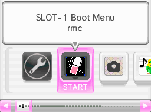

# SLOT-1-Boot-Menu

A SLOT-1 home menu alternative for DSi development units. Some dev units like the X4 [prototype](https://wiki.raregamingdump.ca/index.php/DSi_Pre-X4_Prototype) *(this says unconfirmed pre-X4 but the same shells are used on confirmed X4s)* have no home menu, so you can't run backup tools through any NAND exploit or by installing a TAD. Since prototypes can still boot from SLOT-1, this program acts as a secondary home menu to give access to running software from the SD and makes prototypes a bit more usable.

- Full NAND/SD access from SLOT-1
- Boot an SRL from the SD (`sdmc:/boot.nds`)
- Boot MachineSettings and the Launcher from NAND
<!-- - Can check the DSi version (todo because I don't know C and this is my first "real" C program... even if it's 99% stitched together SDK code) -->
- Boot TwlNmenu from ROM

## Compiling
You will need the TwlSDK 5.5 and TwlSystem 2.2.0 installed and fully set up. (please don't ask how, I don't even know how I set up my copy)

Once set up, just run `make` in the cygwin terminal!

## Credits
- [minitwlpayload](https://github.com/yellows8/dsi/tree/master/exploits/minitwlpayload) to boot SRLs on the SD card
- [stylehax](https://github.com/nathanfarlow/stylehax) for the payload loading code